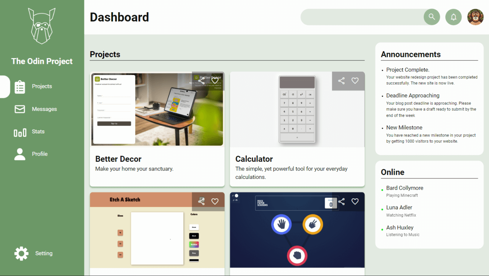

<h1>Project Dashboard</h1>

<strong>Live Preview : </strong> <a href="https://odinprojects-bene.vercel.app/projects/dashboard/">Vercel</a>

<h2>Screenshot</h2>

<h2>Techniques Learnt</h2>
<ol>
    <li>Fluid Grid Layout</li>
    <li>Nested Grid Systems</li>
    <li>Using Grid Template areas to form layout</li>
    <li>Flex Layout</li>
    <li>Creating Dynamic Data and error checking if request for data fails</li>
</ol>

<h2>Problems faced and Solutions</h2>
<dl>
    <dt><strong>Position Fixed</strong></dt>
    <dd>If the parent of a position fixed element has properties such as <strong>transform, backdrop-filter</strong>. The Position fixed does not work.</dd>
    <dt><strong>Solution</strong></dt>
    <dd>Removing The backdrop-filter from the body-wrapper and changing colors</dd>
</dl>
